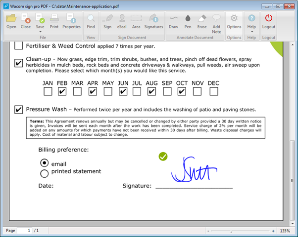
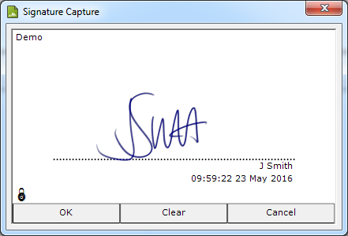
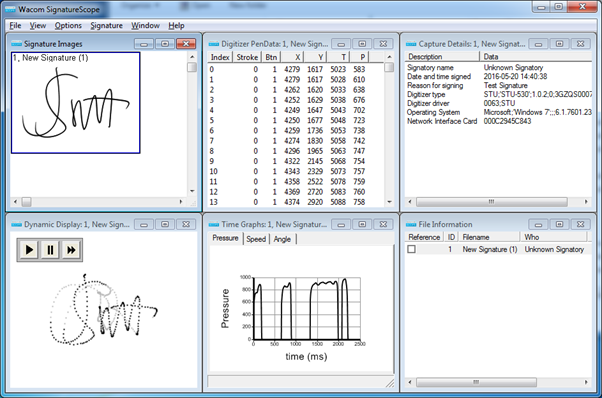

# Wacom Ink SDK for signature - Windows

## Introduction

---

The *Wacom Ink SDK for Signature* includes the Wacom Signature Library used to capture handwritten signatures from a pen device or tablet.
The Signature Library simplifies the interaction with Wacom pen tablets and provides API to manage and display signatures.
While this introduction is based on the Windows version of the Signature Library, the principles also apply to the mobile versions.

The Signature Library is used by the Wacom sign pro PDF application:



Sign pro PDF uses the Signature Library API to capture and render signatures.
To avoid a common misconception, note that the Signature Library does not include PDF related API and sign pro PDF uses a separate SDK to display and modify PDF documents.

## Signature Library Installation

The components are installed as a set of COM DLLs.
Access from an application is through the Microsoft ActiveX interface rather than DLL linking:


## Signature Capture

An application using the Signature Library will provide a way of starting signature capture, for example by displaying a ‘sign’ button.
The resulting call to the signature capture function will display a dialog:



The signature capture function isolates the application from the type of pen input device.
The Signature Library detects the type of connected device and automatically runs the code needed to communicate with it.
Usually the pen input device will be an STU tablet such as the STU-540 or a Wintab device such as the DTU-1141.
From an interface perspective these are very different devices but the Signature Library allows an application to use them in a common way.

The dialog shows the username, reason and timestamp which will be saved with the signature.
While signing, the user can see the pen trace and clear it to sign again if needed before accepting the signature with the OK button.

A dialog is used so that the signing process can be independent of the underlying document to which the signature will be applied.
For example, if the document view has been zoomed the signature can still be captured in the normal way and then adjusted to fit into the document display area.

To provide a high quality pen and ink experience the signature components use Wacom Universal Ink technology for signature capture and image creation.

The Signature Library installation includes common language translations.
The Windows installation language is detected and the relevant language is selected automatically.

## Signature Object

The Signature Library creates a Signature Object to hold a captured signature.
A signature can be handled by an application in its native binary format (Forensic Signature Stream - FSS) or in the Base64 text encoded format such as the following example:

**Base64 Signature Object:**
```
RlOArRoBGwECGEVDFxYZVAUHCQoDBggEDQxPFB0cGhsYFQIiBSAl75yzZny19rFciTS2f1ymdEac
0QlPR02Medd9aMalKkUCyypDAQEXBAN3aG8WBAN3aHkZIgQg5b9IOeA+BQ71Al5EWhYUneLmb44n
CmEt5FrZ2Q3UgORUBAMxNTcFCgEFALBUoI0GAgAHCgEFANAyoI0GAgEJCAEFAADoBwQACgoC8QKe
JQoEAlvUAxsC8QIBCAMUJAAE5AAzMABOAAN6AAQwADFAAEAGrAMC8QKCIAcJowMGAAH/CAnaBgIA
P9+/z+Pr9Ph6/P4+92unzeLvt0B2vDb8Dj9j2fcGBYQisbEIkkwlkYhASDxIA8GotEwgD4bDAWCI
QB4NBYKAgf+BgQBAHcFAADgoFg0HhIKBcCGt4bDgXCYOBII//9+3y+Ps9Hf6/P5YLj4eNxePy+j1
+95/f+wMEg0JRWNByPR2NhWHQh//p5+50eRu9prwOqx6zab7ndz2/cBhcRDQfEMjE0pFctlcqEwi
DgUhoDfj09/sAer27Hc7/m9v2/wEBQOCIEJ6AkEAaCQL//39/l8Pd7Pb7vj9QQBAQBP0AAGCwYBC
G8Ig4GgoDgQAfz8fb6fX7/n+gECAcECPwAB4QAg/uEAeEAiEAaCgMAwECAHgBAMCggFg0HBAJAgp
9CQQB4OAg/+DgWBBgAHAQh8CIPBYJAwEAAAIC//oAAUDAkFAsGAQX+BQACgEJfgiEAeBCAEI/AaC
gQBAABAXoAgICgcFA4IAQnVCQQBYNAv++/j7XO4W31un0mt2233e+5Ha9oAEA9LZ3RqdU6kTyLOh
dIYsCoE9nc6XGAixAwLxAqgVCAmoAwMAX3/CgcFAyHxMLRnOR5OpuMZWJRBGwsEYYCIJAP8+3u9H
c6nI3euzOKu9rsFjuOF0e96nm+wBBwYDohEQkFAsF4wGYwFwpEQeDAXCILAQB//oAAPzAPgA+v58
/k8Pg8fl9XuAfZyePz+Ty+rzef0er1/H7fz/gIDAsHBMLh4UDIdEEklIuGMBNHGZzEWCeRB2MhUJ
A+FwgBwD+vn6/F2ujyuHwuBxOFweNweKA8Ps4nG4vJ6PY8vx/YGB4UDYfEoqF4zGg1GgCMvYWCYQ
hkLhIGAgBfr8gPz/Pl8Pj7/mA/IA+AD7gH3/3y93xAfd4gD2/f8f3/gMEg4KBsRCwZjsiAJH6SAO
hiKRIHguEAOAPl6/H2uhwdrqtPrNxx+16QIAcYeFAyIBKJxQJJBHAtEweCgK/3y9Hg63L3uy1Ok0
+w4fW9QCAKwMiYZD0jEsmkkfjQTBwKAoAfHzdvo8TebPWa3Zb/peP6gANi0ckcoFUqEogjgWCMNg
oDfTzeHn8vh7zgcrte38gYEg8JA8HAcAf36+vydzq9Lq9zzfP+gsNCUdEImlAgAEGQLxAgEIAhIk
ADOAATQAM3ABewAwsAEVADAN3gIC8QKKBQcL1QL0CUC4DwEAJAWAwCAr6AUAgAP/AgA/gC///8BA
DwASAwB4DAEgFAD/7/X+P6/o+d1zgnE/KOAAeUrAvBEB4CoEwJAUBAV0gNAYAgAoBgBgEAF/3/n+
v7fv/b+z939f8f5/3/z/4BQDAQFfAGgRAcA0BQEBHYAwBf8/z/L9r5PcOFcU7+3ABzQgEQIAMgUg
hA4BoCwFAJAOASAcCATyAUAQAAA/9ACAIAIEAQEAP7///gBAf/+AA/7/6AL/oAQBAAAEBAABAF8A
CAIAAAgAgwBAgA/wAADAgB7ACAB///v/P9/9/1///3/QIAPP/wAACAGAQAX/wAgQAfwCgAAgB9gA
/8AIAf/wAAf+/QAAB/6AAD/8EALyAMAQAwC//AGAL/wH//f/P+/8fu+v53nnCeDeaFgA0uOAmBAB
4CgEgKAOAkA4CAAgC/7/z/3+P6/k9byfbm6/PAwIAQUA/wcAAABPBQRA9oXuFAgBBACwVADQMh0W
FQbwTaLdb5YGAFBWwAABBgBQVsAACBwnJk1pY3Jvc29mdDsnV2luZG93cyA3Jzs7OzYuMS43NjAx
LjE5MTYwGiEgU1RVOydTVFUtNTMwJzsxLjAuMjswOzNHWlFTMDAwNzIbCQgwMDYyO1NUVRgHzrGb
ugU8ABULAQTVFNiQAZJCkkI=
```
The Signature Object contains the following data:

    * Name
    * Reason
    * Date timestamp
    * Application specific data
    * System information
    * Pen data

## Signature Image

API is provided to create an image from a Signature Object. Options include:

    * Image format (png/bmp etc)
    * Image size
    * Transparency
    * EncodeData

The EncodeData option produces an image of the signature which contains the complete SignatureObject concealed in pixel attributes (using steganography), for example:


## Signature Data

Data is stored in the Signature Object in an undisclosed proprietary format and API is provided to extract parts of it:

    * Name
    * Reason
    * Date timestamp
    * Application specific data

One type of application specific data is the hash of a signed document.
Before starting signature capture the application can calculate a hash value for the document and include it in the signature data.
At a later time the application can recalculate the hash and use the API to compare the new and saved values to determine whether any changes have been made since signing.
The results can then be used to indicate the validity of a signature.

API is not provided to extract the pen data because this is personal information which could be used fraudulently.
When legitimate access to the full data is needed, such as when the authenticity of a signature is assessed by a qualified Forensic Document Examiner, this is possible using the SignatureScope application:



## Signature Compatibility

Signature Libraries are available for:

    * Windows
    * iOS
    * Android

Regardless of the operating system, signatures are created in the same Signature Object format for full compatibility.
This means that signatures can be readily exchanged and used in related applications: 

    * SignatureScope
    * Dynamic Signature Verification (DSV)
    * Sign pro PDF

## Signature API Examples

The Signature Library includes examples in a range of languages including:

    * HTML
    * Java
    * JavaScript
    * C++
    * C#
    * VB

 A full description of the API can be found in the Signature-Components-API document.
    
## GitHub Samples

Samples are included to help get started with the SDK.

---

# Additional resources 

## Sample Code
For further samples check Wacom's Developer additional samples, see [https://github.com/Wacom-Developer](https://github.com/Wacom-Developer)

## Documentation
For further details on using the SDK see [Wacom Ink SDK for signature documentation](http://developer-docs.wacom.com/sdk-for-signature/) 

The API Reference is available directly in the downloaded SDK.

## Support
If you experience issues with the technology components, please see related [FAQs](https://developer-support.wacom.com/hc/en-us)

For further support file a ticket in our **Developer Support Portal** described here: [Request Support](https://developer-support.wacom.com/hc/en-us/requests/new)

## Developer Community 
Join our developer community:

- [LinkedIn - Wacom for Developers](https://www.linkedin.com/company/wacom-for-developers/)
- [Twitter - Wacom for Developers](https://twitter.com/Wacomdevelopers)

## License 
This sample code is licensed under the [MIT License](https://choosealicense.com/licenses/mit/)

---
